# End of Module 4 Project.

GA WDI-idn-23 integer Project Four. created by John Evans release 1.0 16 December 2016.

# SoBuyLocal

Play the game [here](https://sobuylocal.herokuapp.com/#/)

### Overview

**YSoBuyLocal** is a service developed to provide customers with the means to purchase foods from their local stores at a discount on the basis of food items reaching near their used by dates.

---

### Technologies Used
* Angular
* Rails 5 to serve data from an SQL database
* API
* Javascript
* jQuery
* HMTL5
* CSS3
* Heroku
* git
* CLI

---

### Project Approach
Over the first three days much of the focus was on planning and deciding on a list of Must haves in efforts to achieve MVP. Clarification of Should haves was also considered as well as understanding what would need to be out of scope at this stage of project delivery. 

### Preparation

The work was undertaken by completing small modules of the project as the overall solution evolved enabling effective progress. Tools such as Trello to support planning as well as Balsamic and Draw.io were used  to compleete wireframes and entity realationship diagrams respectively.

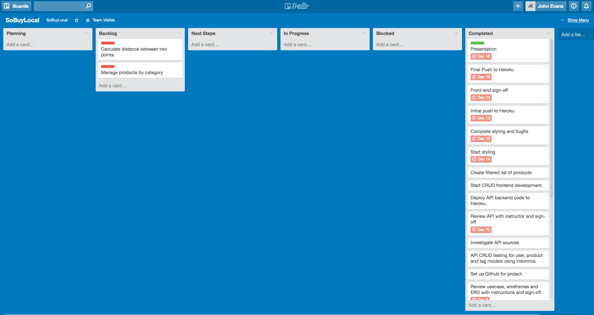

Planning with Trello.

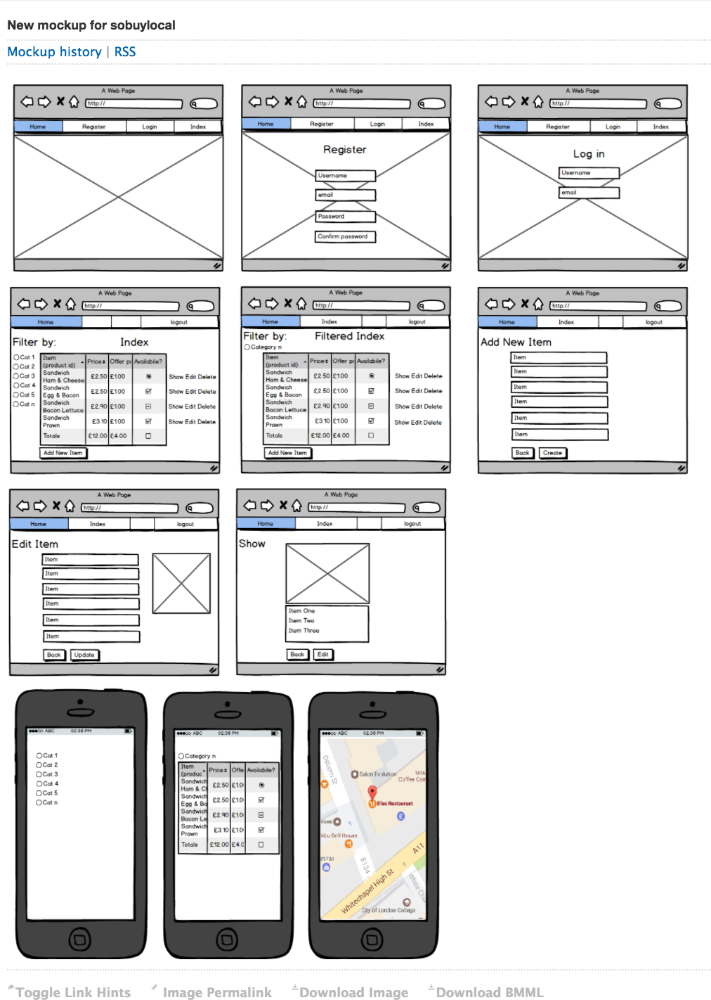

Balsamic wireframe.

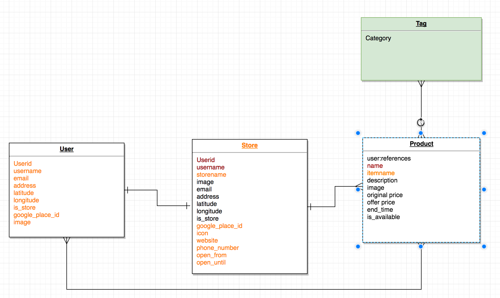

Entity Relationship diagram.

###Deliverables provided by the SoBuyLocal Service

The SoBuyLocal service provides a fully RESTful solution for two types of users - Customer and Store users.

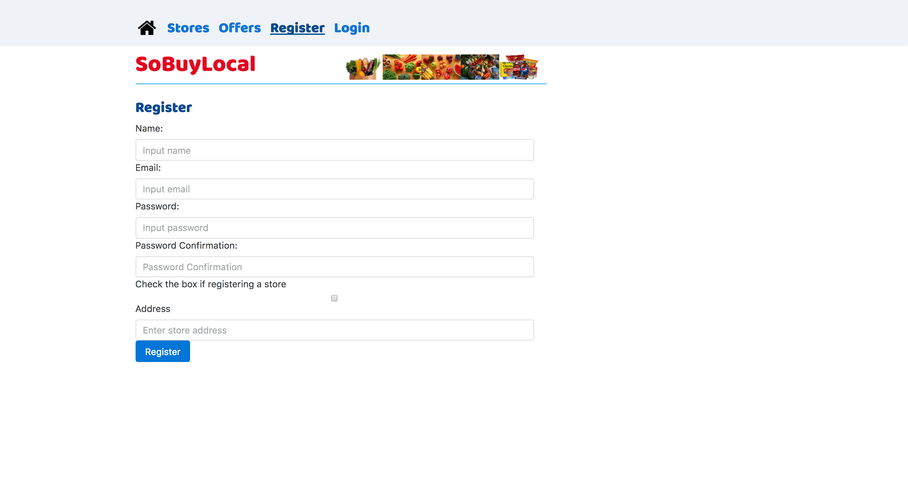

Users are required to register on first use of the service. If they are a Store user they will be asked for additional details such as store opening hours and contact information.

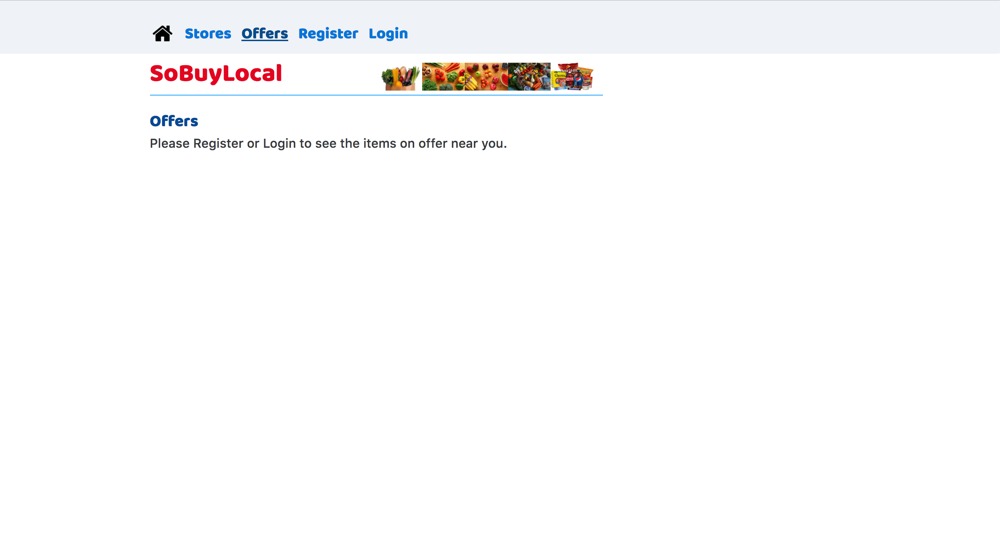

A user will only be able to see the show list of stores page if they are not logged in.

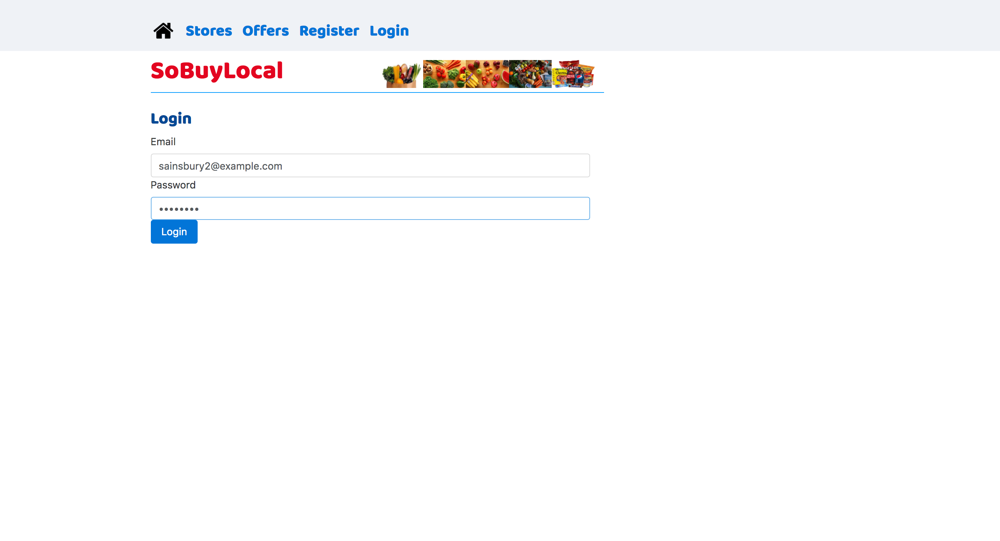

Once registered users will be able to log in using the email and password provided at registration.

Once logged in, Stores will have access to their list of products that they will be able to manage by putting on offer for potential customers to see and courage to go the store to purchase on the basis of the price on offer and their locallity.

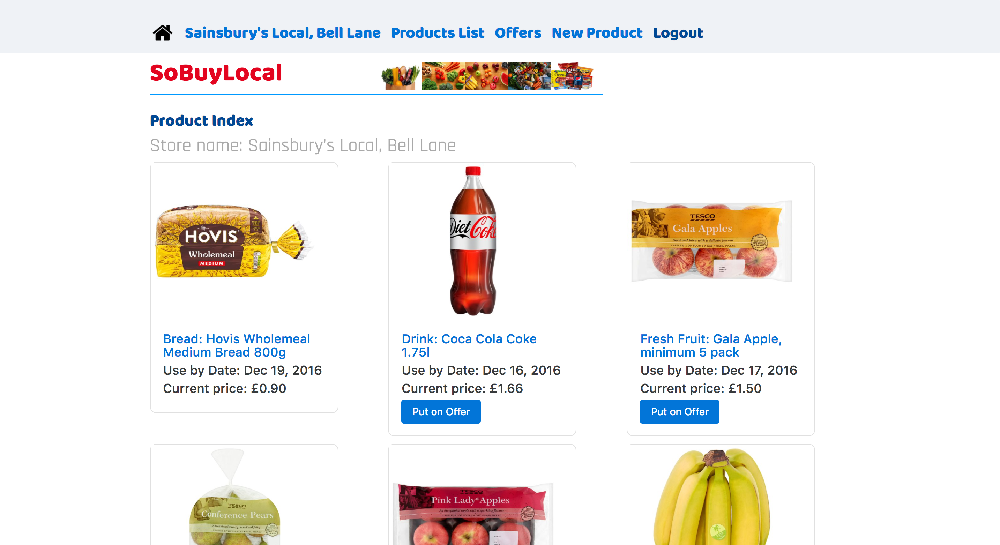

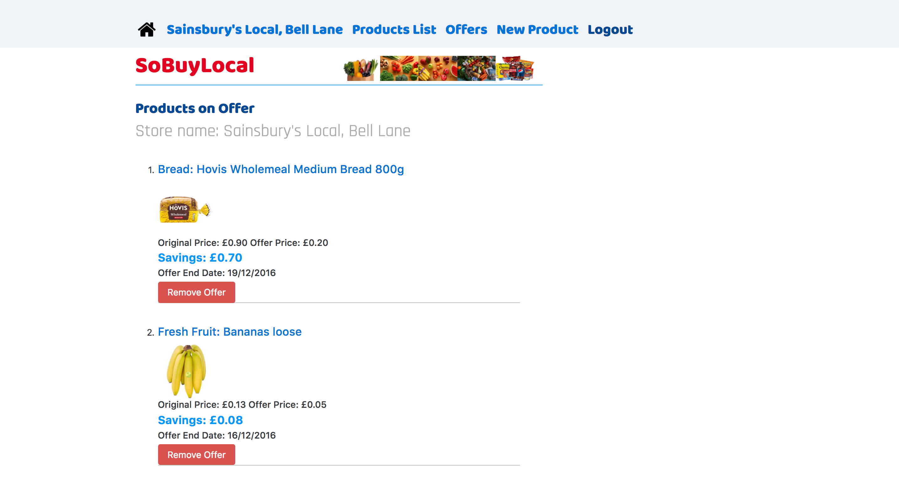

Stores are able to edit the items on offer; changing the offer price and end date for purchase that will be seen by the customer.

The Store will be able to add new product to their store exclusively.

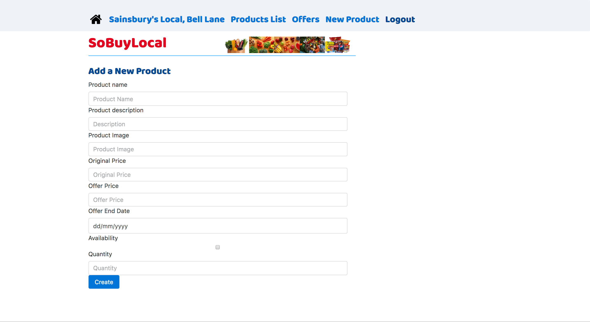

Customers when logged in will be able to see there location by geolocation and their proximity to an index of local participating stores.

WDI-Project4-Frontend/src/images/screen_shot_addProduct.png

Customers will also be able to see the offers avaialbe at all stores and be able to see details of the stores in which they have an interest in the offers provided.

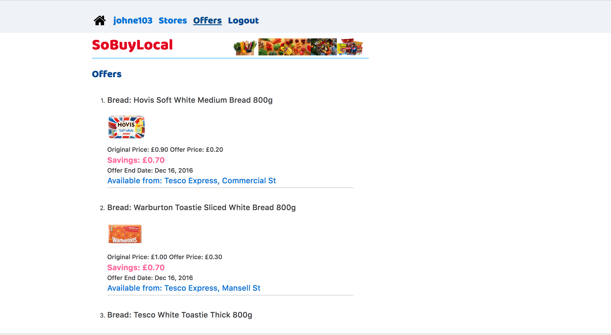

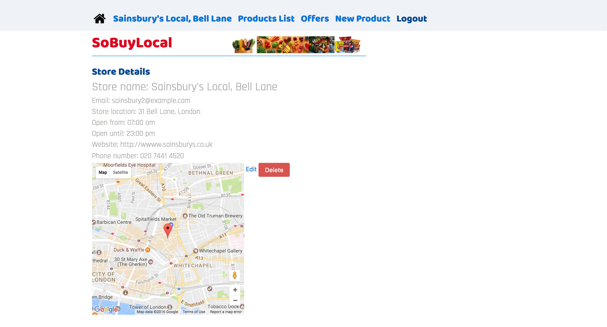

###Challenges faced

- Translating the concept into a workable solution, using the knowledge gained during the 11 weeks on the course. This meant that it was important to manage the scope of the project in order to achieve a viable solution in the 7 day time frame provided.
- The schema initially accounted for two types of users -stores and customers being managed within the same model. It was necessary to distinguish between the two types of users with code using a flag within the schema backend that was managed within Angular in the front end.
- There was a desire to include addtional functionality such as the distance between the store and the customer, but there was insufficient time to compelete this during the time available and would therefore need to be completed at a later date. 

###Where to from here?
The service could be improved in the following ways:

* Develep a mobile component for customers allowing them to have access to offers from local stores within a mile of there location.
* Improve styling to make the site more eye catching for stores and customer users.
* Adding functionality for online payment for items the customers wish to purchase from their local store.
* Adding functionality for directions from the customer location to the selected local store.
* Add funtionality to provide the distance between the local store and the customer.

###Bugs/Issues
- The burger menu bar the appears when the screen size is reduced to below 890px width does not work.

